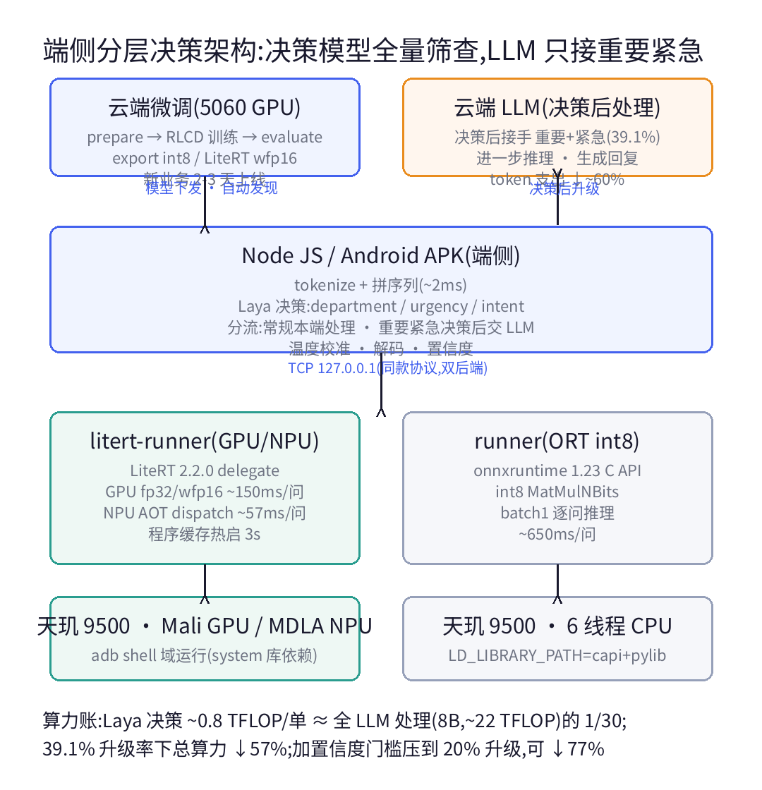
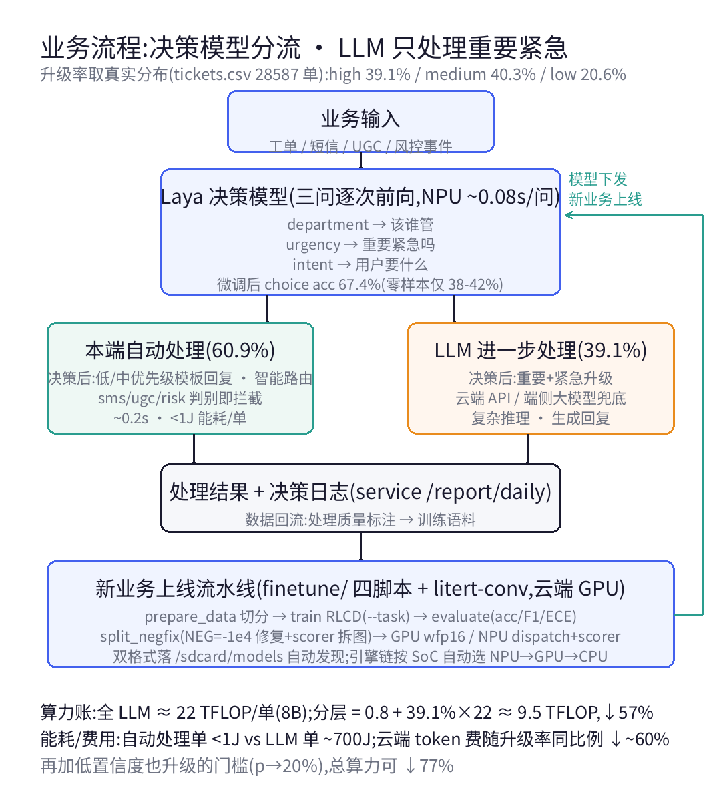
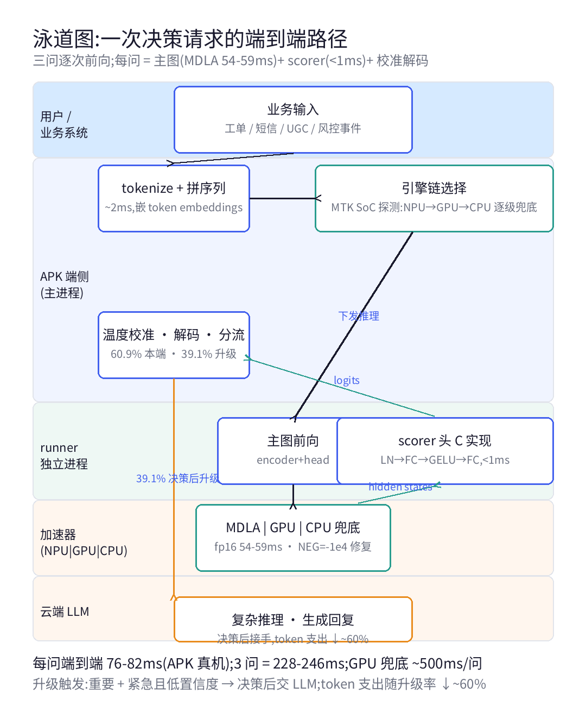
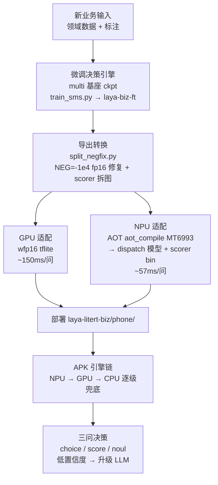

# laya-test — Laya 决策模型 Android/Termux 本地推理

在手机(Termux, aarch64)上运行 [Laya](https://huggingface.co/convaiinnovations/laya) System-1 决策模型:给定工单/文本(state)和类型化问题(choice/score/noul),单次前向返回带校准概率的答案,不生成文本、无幻觉。

## 下载 APK

**[v1.3.0 — NPU 决策全链路打通](https://github.com/supermy/laya-test/releases/tag/v1.3.0)**(内置 MTK NPU 后端 + 5 业务,天玑 9500 自动启用 NPU,其他机型自动落 GPU/CPU):

```
https://github.com/supermy/laya-test/releases/download/v1.3.0/layaoffice-1514.apk
```

国内网络直连 GitHub 卡顿时,任选一个镜像前缀拼同一链接:

```
https://ghproxy.net/https://github.com/supermy/laya-test/releases/download/v1.3.0/layaoffice-1514.apk
https://gh-proxy.com/https://github.com/supermy/laya-test/releases/download/v1.3.0/layaoffice-1514.apk
```

安装后需在系统页安装模型包(`/sdcard/models/laya-litert*/`,zip 内含 NPU 主图 `laya_ml_s256_embeds_npu.tflite` + `laya_ml_scorer.bin` 时 MTK 机型自动走 NPU)。

## 架构

```
应用(Node/HTTP 客户端 / Android APK)
  │  tokenize + 拼序列(@huggingface/tokenizers + sequence.js,~2ms)
  ▼
TCP 127.0.0.1 / Unix socket(长度前缀分帧协议,两端同款)
  ▼
┌─ LiteRT NPU 路径(最快,5/5 模型)─────────────────────┐
│ litert-runner(LAYA_BACKEND=npu,app 域可直接跑)        │
│   ├─ 主图:AOT dispatch(MT6993 MDLA)54-59ms/问        │
│   │  split 架构:NEG=-1e4 fp16 修复,输出 hidden states │
│   └─ scorer 头 C 实现(LN→FC→GELU→FC,<1ms)             │
├─ LiteRT GPU 路径(兜底)───────────────────────────────┤
│ litert-runner + GPU delegate(fp16,Mali 天玑9500)      │
│   ~150ms/问(异步提交+回读同步)+ act 头(CPU)           │
├─ onnxruntime 路径(CPU 兜底)──────────────────────────┤
│ runner(C 守护进程)→ onnxruntime 1.23 int8 量化模型    │
└───────────────────────────────────────────────────────┘
APK 内:引擎链按 SoC 自动选 NPU → GPU → CPU 逐级兜底
```

- 三条路径**协议完全同款**,客户端(`laya-native.mjs`)零改动复用;JS 侧负责 tokenize/查表/温度校准/解码
- 模型在 `/sdcard/models/`,全程无 Python 依赖
- 单张工单(3 问)端到端:LiteRT **NPU ~0.23s** / GPU ~0.45s / multi int8 ORT ~1.2s

- 两条路径**协议完全同款**,客户端(`laya-native.mjs`)零改动复用;JS 侧负责 tokenize/查表/温度校准/解码
- 模型在 `/sdcard/models/`,全程无 Python 依赖
- 单张工单(3 问)端到端:LiteRT GPU ~0.45s / multi int8 ORT ~1.2s



**分层决策(算力经济性)**:决策模型全量筛查,常规问题决策后本端自动处理;重要+紧急(升级率取 tickets.csv 28587 单真实 high 占比 **39.1%**)在**决策完成后**交付 LLM 进一步处理(复杂推理 · 生成回复,不参与决策阶段)。每单算力:全 LLM ~22 TFLOP(8B,1400 tok)vs 分层 0.8 + 39.1%×22 ≈ 9.5 TFLOP,**总算力 ↓57%**(升级率压到 20% 可 ↓77%);端侧能耗 <1J vs ~700J/单,云端 token 费随升级率同比例 ↓~60%。





## 模型

| 模型 | 大小 | 语言 | 强项 | 切换 |
|---|---|---|---|---|
| **litert**(NPU/GPU,推荐) | 251MB wfp16 tflite + 393MB embedding 表(NPU 版另含 251MB dispatch + 2.4MB scorer) | 100+ 语言(mmBERT) | 官方 LiteRT 转换,MTK 天玑 9500 上 NPU ~57ms/问 / GPU ~150ms/问,概率带官方温度校准 | `loadLitert()` |
| **multi**(ORT 默认) | 326MB int8 | 100+ 语言 | 中文/德文置信度高,sales/other recall 好 | 默认 |
| en | 606MB int8 + 606MB data | 英文训练 | billing/technical recall 好,urgency 有官方温度校准 | `LAYA_MODEL=en laya serve` |
| **sms**(微调) | int8 | 中文 | 垃圾短信/骚扰判别(80 万条真实短信微调) | `LAYA_MODEL=sms laya serve` |
| ticket / ugc / agent / risk / stock(微调) | int8 | 中文 | 四+一业务微调模型,`/sdcard/models/laya-*-int8/` | service 自动发现 |

LiteRT 模型集(litert-community/Laya-Multilingual-LiteRT,sha256 已验)放 `/sdcard/models/laya-litert/`;微调业务 LiteRT 版放 `/sdcard/models/laya-litert-{task}/`(5060 上自研转换链产出,精度=ckpt)。NPU 部署(2026-10-09 起 5/5 模型):各业务 `phone/` 目录含 `laya_ml_s256_embeds_npu.tflite`(AOT dispatch)+ `laya_ml_scorer.bin`(拆图 scorer 权重),multi 在无后缀的 `laya-litert/phone/`。

## 微调(云端 GPU)

`finetune/` 四脚本:`prepare_data.py`(数据切分)→ `train_sms.py`(RLCD,`--task` 任务化)→ `evaluate.py`(choice acc/F1 + noul P/R/F1/ECE)→ `export_onnx.py`(fp32+int8,签名与现网对齐)。训练在 5060 PC(RTX 5060 Ti),详见 `finetune/parity-report.md` 与 `examples_guide.md`。注意:int8 导出会使 noul 温度校准失效(ECE 0.03→0.23-0.30),概率阈值部署前须手机端重校准;LiteRT fp32/wfp16 路径无此问题。

**新业务上线流水线**(微调 → GPU/NPU 双格式适配):



要点:微调只产出 torch ckpt(encoder+head+scorer 权重),是 GPU/NPU 两条线的共同源头;NPU 必须走 `split_negfix.py`(掩码常量焊死在成品图里改不了)+ PC 端 AOT 编译,产物为 dispatch 主图 + scorer bin;运行期由 APK 引擎链按 SoC 探测自动选择,业务代码无感知。

## 快速开始

```bash
# 确保唤醒锁(防息屏降频)
termux-wake-lock

# 常驻 HTTP 服务(默认 multi 模型,端口 8787)
laya serve                # GET /health,POST /system-one
LAYA_MODEL=en laya serve  # 切英文 checkpoint
LAYA_MODEL=sms laya serve # 垃圾短信判别,另有 POST /sms {"text":"..."}

# 多业务服务(端口 8789,自动发现 /sdcard/models/laya-*-int8)
node service/server.mjs   # GET /tasks,POST /task/:id,GET /report/daily
                          # GET /report/page — 详单页:业务×决策等级×日期,点击下钻明细

# 单次推理
echo '{"state":{"subject":"...","body":"..."},"questions":{...}}' | laya infer

# 工单分流
curl -s localhost:8787/system-one -d @ticket.json

# 垃圾短信判别
curl -s localhost:8787/sms -d '{"text":"短信正文"}'
```

问题类型(与官方 system_one API 同形):

```json
{
  "department": { "type": "choice", "instructions": "Which team?",
    "criteria": { "billing": "...", "technical": "..." } },
  "urgency": { "type": "score", "instructions": "How urgent?",
    "criteria": ["not urgent", "urgent", "critical"] },
  "intent": { "type": "choice", "instructions": "What does the user ask for?",
    "criteria": { "refund": "...", "fix": "...", "info": "..." } }
}
```

## 测试

```bash
node triage-test.mjs            # 11 用例分流回归(自动拉起 serve)
node validate-historical.mjs    # 真实历史工单回归(需 tickets.csv + sample.jsonl)
node e2e.mjs                    # native vs wasm 输出一致性
node e2e-litert.mjs             # LiteRT GPU 全链路(adb 自连,自动拉起 litert-runner)
node parity.mjs                 # LiteRT GPU vs multi ONNX 语义对齐
node parity-task.mjs            # 微调任务手机端对拍(metrics 口径与 evaluate.py 对齐)
node parity-litert.mjs          # 微调任务 LiteRT GPU 版对拍
node sms-e2e-test.mjs           # SMS 判别管路测试(multi 模型+覆盖问题定义)
```

## 文件结构

| 文件/目录 | 说明 |
|---|---|
| `litert-runner.c` | LiteRT 版 C 守护进程(NPU split 主图+scorer C 实现 / GPU 主图 + CPU act 头,TCP/unix/abstract socket;`LITERT_DISP_DIR`/`LAYA_SCORER` 可配) |
| `laya-litert.mjs` | LiteRT 客户端:adb shell 域或本地 spawn(`LAYA_RUNNER_LOCAL=1`)拉起 daemon + `loadLitert()` / `stopLitert()` |
| `e2e-litert.mjs` / `parity.mjs` | GPU 链路 E2E / 与 ONNX 路径语义对齐 |
| `litert-bench.c` | LiteRT 基准(GPU/NPU 旋钮 + 输出一致性校验;计时含回读同步) |
| `runner.c` / `runner` | C 常驻推理守护进程(ORT C API) |
| `laya-native.mjs` | Node 客户端:tokenize → socket → 后处理,`LayaNative.loadWithDaemon()` / `smsInfer()` |
| `cli.mjs` → `~/bin/laya` | CLI:`infer` / `serve` / `status` / `stop` |
| `service/` | 多业务决策服务:自适配注册表 + 决策日志报表 + 邮件/MQTT 网关(端口 8789;`GET /report/page` 详单页:业务×决策等级×日期,可下钻) |
| `finetune/` | 微调管线:数据准备/RLCD 训练/评估/导出 + 任务定义 + parity 报告 |
| `apk/` | Android APK(智能决策业务台):LiteRT NPU/GPU 内置推理(MTK SoC 自动选 NPU,引擎链 NPU→GPU→CPU)+ 动态业务 + 网关 + 微信风 UI;系统页四个子标签(系统/架构图/流程图/数据流,`DiagramView` 零依赖自绘);报表页含「下钻详单」:业务×决策等级×日期矩阵,点数字下钻明细;网关页含 LLM 设置×3(升级通道可选,OpenAI 兼容) |
| `figs.py` / `figs/` | 公众号/README 配图生成脚本与产物(性能对比 / 分层架构 / 延迟台阶 / 业务流程 / 决策泳道图) |
| `bench.c` / `bench86` | 原生推理基准(SEQ/BATCH/OPTS 可编译期配置,nnapi/xnnpack EP) |
| `triage-test.mjs` | 工单分流 E2E 回归 |
| `validate-historical.mjs` | 真实历史工单全量回归 |
| `laya-litert/` | LiteRT 模型兼容目录(软链到 /sdcard/models/laya-litert + laya_config.json) |
| `laya-onnx-int8/`, `laya-multilingual-int8/`, `laya-sms-int8/` | 模型兼容目录(软链到 /sdcard/models) |
| `pylib/` | libpython3.12→3.14 符号链接(ORT 动态库依赖) |

## 性能(天玑 9500,窗口 256,含回读同步)

| 配置 | 单次推理(3 问) |
|---|---|
| wasm fp32(起点) | 4.2s |
| 原生 int8(bench,seq=86) | 0.63s |
| 真实工单端到端(multi ORT,seq≤512) | p50 1.2s |
| **LiteRT GPU fp32/wfp16** | **~0.45s(~150ms/问,冷热基本无关)** |
| **NPU AOT(MTK dispatch,PC 预编译)** | **~0.17s(~57ms/问,目前最快)** |

注意:此前"GPU 17-19ms/问"是计时口径错误(异步提交只计了提交,真实执行在回读);修正后各加速器真实排序为 GPU ~150ms < CPU int8 254-347ms < CPU fp32 ~309ms。NPU 设备侧 JIT 不可用(Neuron UNMAPPABLE),唯一路径是 PC 上 AOT 编译 dispatch tflite。

详细演进见 `changelog.md`,踩坑经验见 `最佳实践.md`。

## 已知边界

- 零样本跨域(非训练分布的工单)准确率 ~38-42%,生产级需微调(官方路径 Kaggle 2×T4,0.362→0.766);微调管线已就位(`finetune/`),ticket 真实数据微调后 67.4%
- int8 导出使 noul 温度校准失效(ECE 0.03→0.23-0.30),概率阈值部署前须手机端重校准;LiteRT fp32/wfp16 路径无此问题
- multi 的 int8 导出未做 urgency 温度校准(分布偏平),urgency 断言仅对 en 有效
- noul 是非判别在中文上不可靠,退款意图请用判别式 choice(intent)
- ugc/agent/risk 微调数据为构造式合成(冷启动),分布≠真实黑产/风控,上线前换真实语料
